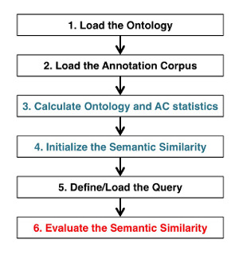

FastSemSim API
==================

The layer of "entrypoint functions" (API) available in FastSemSim conveniently allows interacting with ontologies, Annotation Corpora (ACs) and semantic similarity without knowing the inner workings of the FastSemSim library.

This section describes these entrypoint functions and explains how to use them.
Examples and use cases are presented as well.

The standard processing workflow used when calculating semantic similarity scores can be recapitulated in the following 6 steps:

For each of these points, some entrypoint functions take care of masking all the inner workings of the package.
It is noteworthy to note that albeit the primary function of FastSemSim is calculating semantic similarity, its representation of ontologies and ACs can be used as a base to extract statistics. explore the data or perform other analyses based on ontology annotations.

0. Importing FastSemSim
----------------------------------

After installing the pacakge, you can import FastSemSim in your Python environment with:

::

   import fastsemsim

1. API - Ontologies
----------------------------------

Loading an ontology
^^^^^^^^^^^^^^^^^^^^^

Loading an ontology from a file or a descriptor (more about descriptors in section FastSemSim Datasets) is as simple as running a single line of code using the entrypoint function fastsemsim.load_ontology:
::

	my_ontology = fastsemsim.load_ontology(...)

If invoked without parameters, this function will load the Gene Ontology shipped with fastsemsim.
Passing the right parameters to the function allows loading other ontologies included in fastsemsim, as well as custom ontologies.

Here the full description of the function:

.. currentmodule:: fastsemsim
.. autofunction:: load_ontology

2. API - Annotation Corpora
----------------------------------

Loading an annotation corpus
^^^^^^^^^^^^^^^^^^^^^^^^^^^^^^^^^

Loading an annotation corpus (AC) is as easy as loading ontologies. The only additional requirement is that an ontology must be passed as parameter to the parser, that will take care of matching the terms in the ontology to the terms in the annotation corpus.
As for ontologies, the AC can be loaded from a file or from a descriptor (more about descriptors in section FastSemSim Datasets) using the entrypoint function fastsemsim.load_ac:
::

	ac = fastsemsim.load_ac(ontology = my_ontology, ...) 

If invoked without parameters, beside the mandatory ontology parameter, this function will load the AC shipped with fastsemsim.
Passing the right parameters to the function allows loading other ontologies included in fastsemsim, as well as custom ontologies.

Here the full description of the function:

.. currentmodule:: fastsemsim
.. autofunction:: load_ac

FastSemSim Datasets
----------------------------------
Ontologies and annotation corpora included in fastsemsim

To list the ontologies available in fastsemsim, you can use the function list_ontologies()

.. toctree::
    :maxdepth: 1

    fastsemsim.data.rst

Semantic similarity
----------------------------------

Putting all together: calculating semantic similarities
----------------------------------

Divers
----------------------------------

